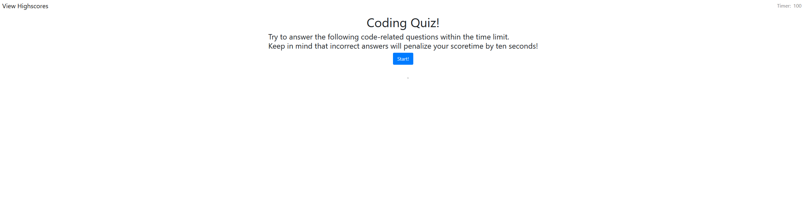

# coding_quiz

A coding quiz that generates questions/answers from an array and then generates the correct HTML/on-click events via event delegation.

Additionally, I've added the functionality of high scores that are sorted using a comparative sort method.

You can check it out here: https://daneburns.github.io/coding_quiz/

